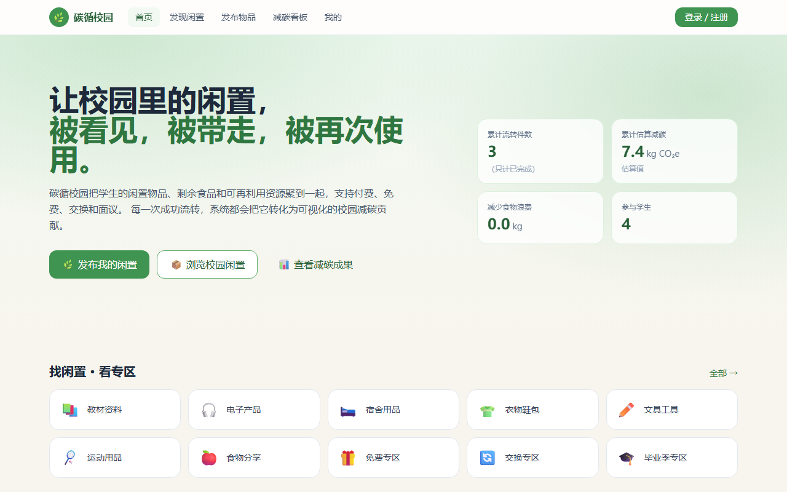
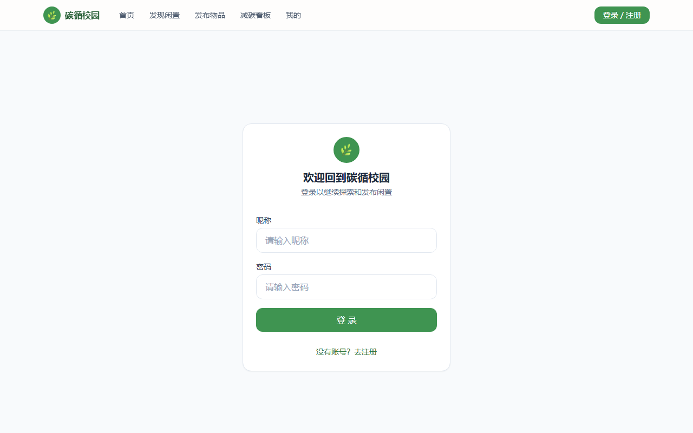
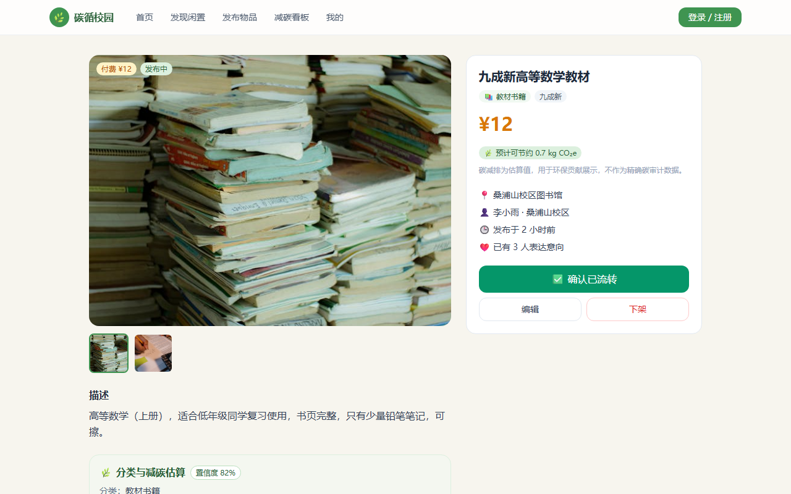
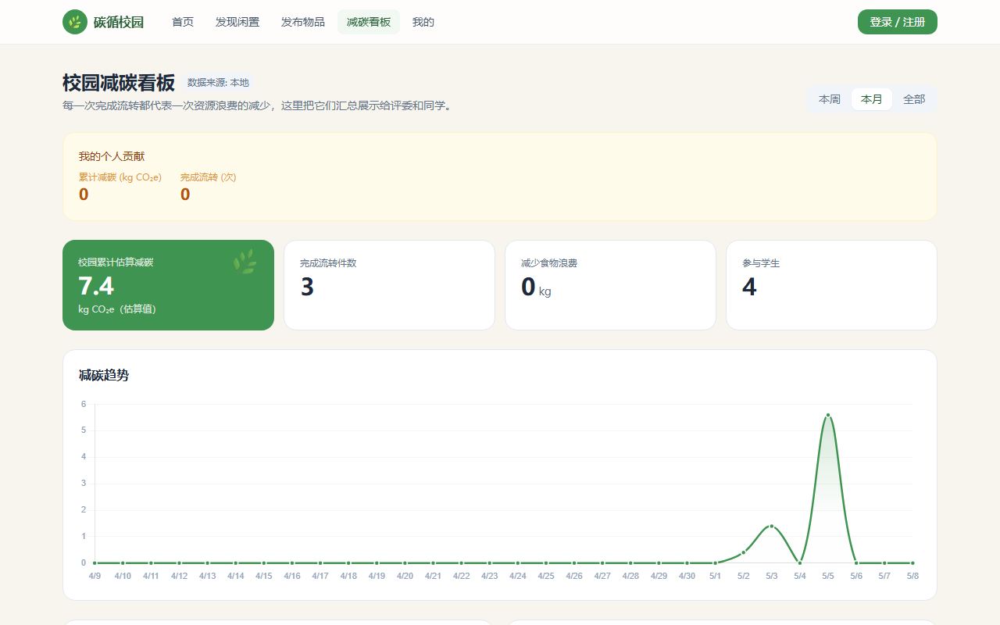
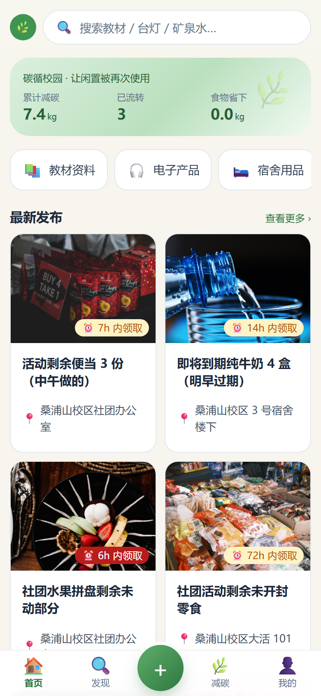
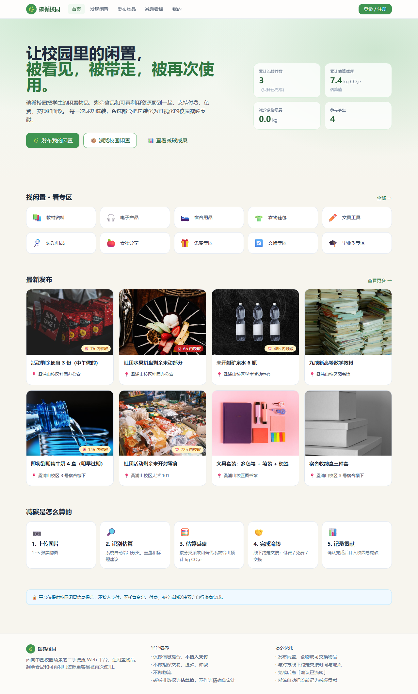
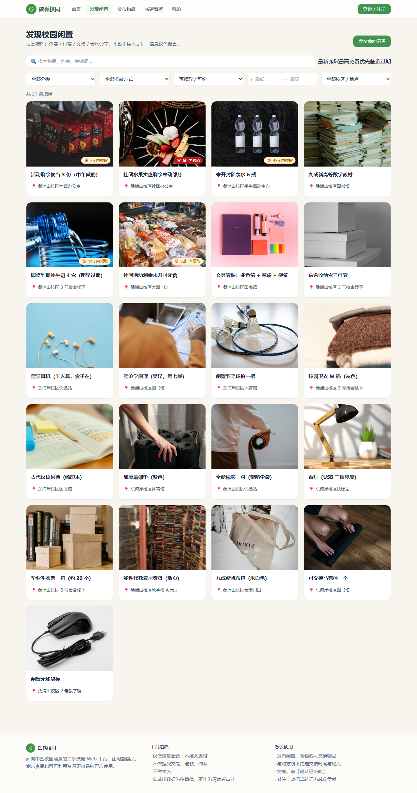
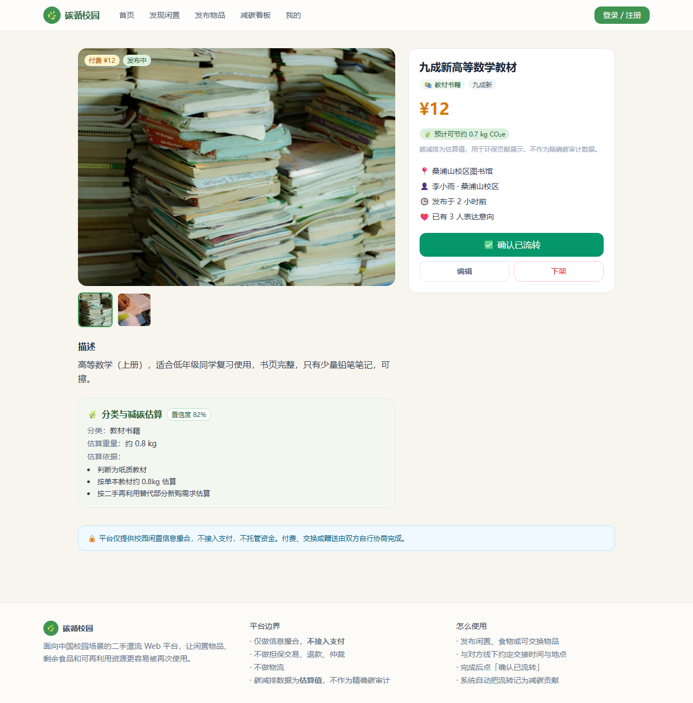
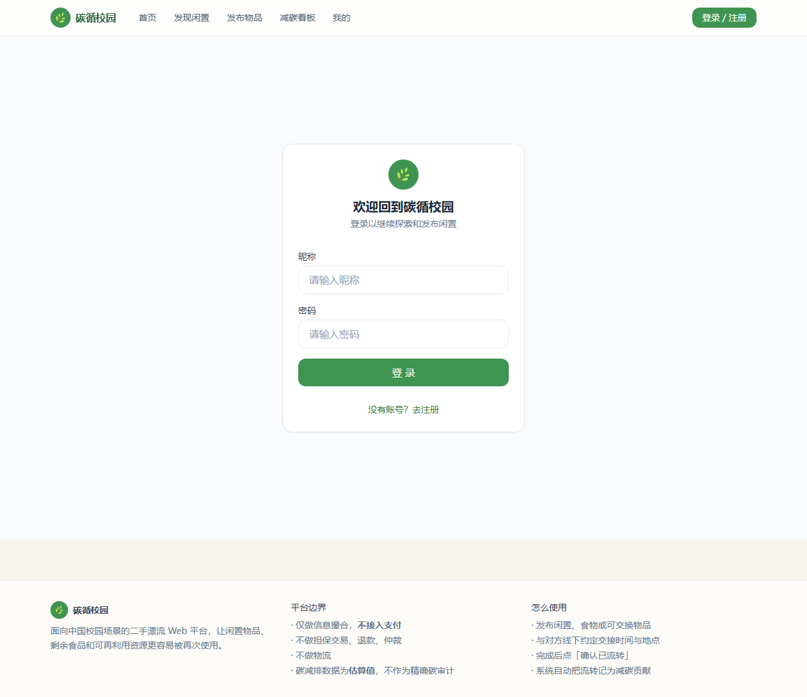
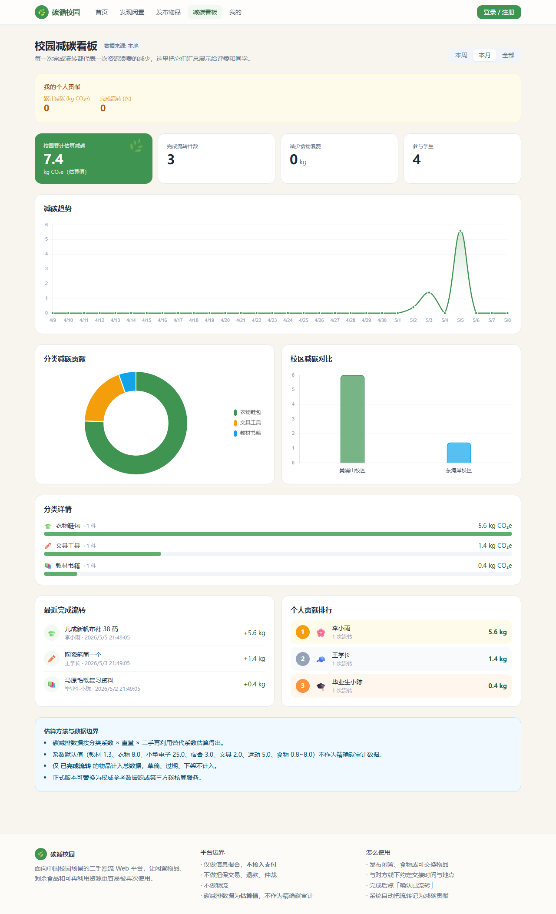

<div align="center">

# 🌱 碳循校园 EcoTrace

### 校园闲置漂流 × AI 碳减排估算平台

**让每一件闲置物品的流转，都变成可见的减碳贡献**



[](https://stu-eco-trace.netlify.app/)
[](https://vuejs.org/)
[](https://tailwindcss.com/)
[](https://www.netlify.com/)
[](https://turso.tech/)
[](https://open.bigmodel.cn/)
[](https://web.dev/progressive-web-apps/)
[](LICENSE)

</div>

---

## 📖 项目简介

**碳循校园** 是面向中国高校的闲置物品流转 Web 平台。学生发布闲置物品、剩余食品和可再利用资源，平台通过 **AI 多模态识别** 自动分析物品类型，基于权威碳排放系数数据库（CLCD / ecoinvent / IPCC）**估算每次流转的碳减排量**，将校园里的每一次资源流转转化为可量化的环保贡献。

> 🚫 平台不接入支付、不托管资金——只做**信息撮合 + 减碳量化**。

**竞赛背景：** 节能减排科技作品类参赛项目，面向汕头大学桑浦山校区 / 东海岸校区实际场景部署。

---

## ✨ 核心功能一览

### 🤖 AI 智能识别

上传一张图片，AI 自动识别物品类别、估算重量、生成标题和描述建议，并给出合理定价区间。



### 🌿 碳减排量化

每次物品流转，平台基于 CLCD / ecoinvent / IPCC 权威数据库估算碳减排量，用生活化的类比让你直观理解贡献。



### 📊 数据可视化看板

减碳趋势折线图、分类环形图、校区对比柱状图——校园环保贡献一目了然。



### 📱 移动端优先

PWA 支持，可安装到手机桌面。底部 Tab 导航、抽屉筛选，专为校园场景优化。



---

## 🔄 完整业务流程

```
用户上传图片
     ↓
🤖 AI 识别物品类别、估算重量
     ↓
🌿 系统计算「预计碳减排」值
     ↓
📝 发布者完善信息 → 发布
     ↓
🔍 其他用户浏览、联系发布者
     ↓
🤝 线下完成流转（付费 / 免费 / 交换）
     ↓
✅ 发布者确认已流转
     ↓
💚 碳减排值计入个人 + 校园总贡献
```

---

## 🗂️ 功能全景

| 模块 | 说明 |
|------|------|
| 🏠 **首页数据看板** | 累计流转件数、减碳量、食物减浪费量、参与人数，数字动画滚动展示 |
| 📦 **闲置发布** | 四步分步表单 + AI 辅助填写 + 图片上传 |
| 🤖 **AI 物品识别** | GLM-4v-Flash 多模态识别，自动生成类别 / 重量 / 标题 / 描述 |
| 💡 **智能定价** | AI 根据物品类别、成色建议合理价格区间 |
| 🔍 **语义搜索** | 输入自然语言，Embedding 语义匹配相关物品 |
| 🌿 **碳减排估算** | 基于 CLCD / ecoinvent / IPCC 系数实时计算 kgCO₂e |
| 💬 **碳减排解释** | AI 将碳数据转化为生活化类比（如「相当于少开 XX 公里车」）|
| ✅ **确认流转** | 发布者确认完成后，碳减排值正式计入总贡献 |
| 🍎 **食物分享** | 保质期管理 + 到期自动过期 + 食品安全提示 |
| 📊 **减碳看板** | 趋势折线图 / 分类环形图 / 校区对比柱状图 / 排行榜 |
| 👤 **个人中心** | 成就徽章 / eco_points 积分 / 个人碳数据 |
| 🔔 **通知系统** | 站内消息（意向 / 流转 / 系统通知）|
| 🛡️ **管理后台** | 全部发布管理 + 内容审核 + 数据导出（CSV / JSON）|
| 📱 **PWA 离线** | Service Worker 预缓存 + IndexedDB 离线数据层 |

---

## 🏗️ 技术栈

```
┌──────────────────────────────────────────────────┐
│                  前端 (Vue 3 SPA)                 │
│  Vue 3.5 ESM + Vue Router 4 + Tailwind Play CDN  │
│  Chart.js 4 图表 · Service Worker 离线缓存        │
│  api-adapter.js: API / localStorage 自动切换      │
└──────────────────────┬───────────────────────────┘
                       │ HTTP (fetch)
┌──────────────────────▼───────────────────────────┐
│            后端 (Netlify Functions, 25+ 端点)     │
│  认证 · CRUD · AI 分析 · 碳统计 · 排行 · 通知     │
└──────────┬──────────────────────┬────────────────┘
           │                      │
┌──────────▼─────────┐  ┌────────▼─────────────────┐
│  Turso (libSQL)    │  │  ZhipuAI GLM 系列        │
│  用户 / 物品 /     │  │  图像识别 · 语义搜索      │
│  碳记录 / 通知     │  │  定价建议 · 碳解释        │
└────────────────────┘  └──────────────────────────┘
```

> **零构建方案：** 无 Vite / Webpack，所有 JS 通过浏览器原生 ESM import 加载。

---

## 🌿 碳减排估算方法

| 分类 | 计算方式 | 数据来源 |
|------|----------|----------|
| 教材书籍 | 重量(kg) × 1.3 × 0.7 | CLCD |
| 衣物鞋包 | 按件 × 8.0 × 0.7 | ecoinvent |
| 电子产品 | 按件或重量 × 系数 | CLCD |
| 宿舍用品 | 重量(kg) × 3.0 × 0.7 | CLCD |
| 食物（通用） | 重量(kg) × 2.5 | IPCC |
| 食物（肉类） | 重量(kg) × 8.0 | IPCC |
| 食物（蔬菜） | 重量(kg) × 0.8 | IPCC |

> ⚠️ 所有碳数据均为**估算值**，前端统一标注"预计"或"估算"。

---

## 📱 页面展示

| 页面 | 路径 | 预览 |
|------|------|------|
| 首页 | `/` |  |
| 发现闲置 | `/listings` |  |
| 物品详情 | `/listings/:id` |  |
| 发布物品 | `/publish` |  |
| 减碳看板 | `/impact` |  |
| 个人中心 | `/me` |  |
| 管理后台 | `/admin` |  |

---

## 🚀 快速体验

### 在线 Demo

👉 **[stu-eco-trace.netlify.app](https://stu-eco-trace.netlify.app/)**

### 本地运行（零配置）

```bash
git clone https://github.com/Yuuqq/Eco_Trace.git
cd Eco_Trace
npx serve new-site/public
# 访问 http://localhost:8080
```

内置种子数据，无需后端即可体验完整页面。

---

## 👥 项目信息

- **类型：** 节能减排科技作品类参赛项目
- **团队：** 汕头大学 EcoTrace 团队
- **校区：** 桑浦山校区 · 东海岸校区
- **版本：** v2.0

---

## 📄 相关文档

- [开发文档 DEVELOPMENT.md](DEVELOPMENT.md) — 技术架构、API 端点、仓库结构、部署指南
- [环境配置 docs/ENV_SETUP.md](docs/ENV_SETUP.md) — 环境变量、Turso、Netlify 部署
- [碳方法学 docs/CARBON-METHODOLOGY.md](docs/CARBON-METHODOLOGY.md) — 碳减排估算方法和数据来源
- [演示脚本 docs/DEMO-SCRIPT.md](docs/DEMO-SCRIPT.md) — 比赛演示步骤
